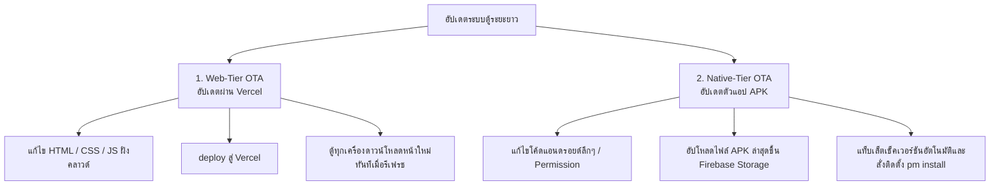
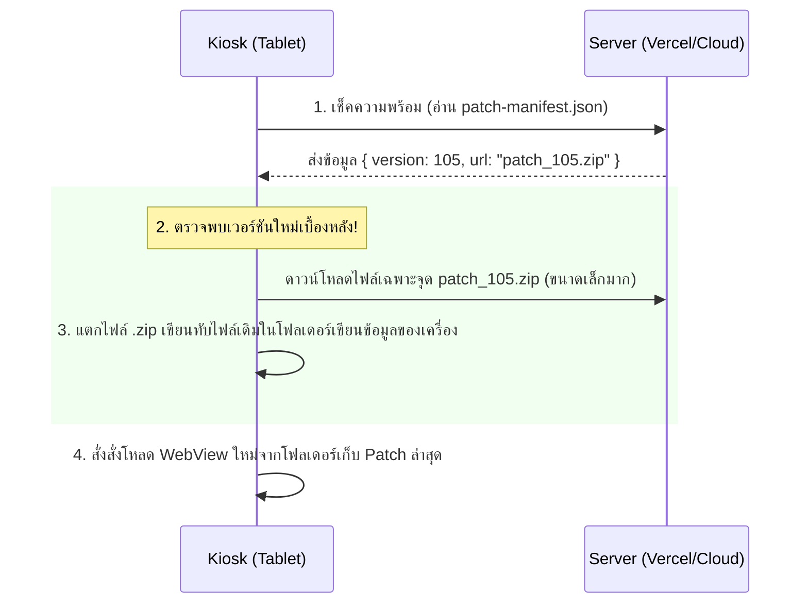

# 📡 แผนยุทธศาสตร์ความเสถียรและการอัปเดตระยะยาว (Kiosk Stability & Long-Term OTA Strategy)

เอกสารฉบับนี้จัดทำขึ้นเพื่อกำหนด **"แนวทางสากลในการแก้ปัญหาแอปค้าง (Anti-Freeze Guidelines)"**, **"ระบบสถาปัตยกรรมการทำ Hot Patch (CodePush-Style)"** และ **"สถาปัตยกรรมการอัปเดตทางไกลแบบถาวร (Two-Tier OTA System)"** สำหรับระบบตู้จ่ายน้ำ Aqua Station เพื่อการดูแลรักษาจากทางไกลแบบ 100% (Zero-Visit Maintenance)

---

## 🟥 ส่วนที่ 1: มาตรการป้องกัน App ค้าง/หน่วง ในระยะยาว (Stability & Anti-Freeze Architecture)

ตู้ Kiosk ที่ทำงานต่อเนื่อง 24 ชั่วโมง มักประสบปัญหาเครื่องช้าลง ค้าง หรือล่มเนื่องจากทรัพยากรระบบถูกใช้งานจนเต็ม (Resource Exhaustion) หรือปัญหาการสื่อสารฮาร์ดแวร์ขัดข้อง นี่คือ 5 มาตรการแก้ปัญหาแบบถาวร:

### 1.1 ระบบ Hardware Watchdog & Serial Auto-Recovery
*   **ปัญหา:** หากระบบสายเชื่อมต่อบอร์ด Serial เกิดการรบกวนทางไฟฟ้า (EMI) หรือกระแสไฟไม่นิ่ง อาจส่งผลให้พอร์ต Android Serial ค้างหรือหยุดการตอบสนอง ซึ่งจะลากให้ WebView หลักค้างไปด้วย
*   **แนวทางแก้ไข:** 
    *   **Watchdog Listener (5 วินาที):** หากระบบทำการส่งคำสั่ง `READ` (0xC3) ไปแล้วบอร์ดไม่มีการส่งสัญญาณสะท้อนกลับ (RX Response) ภายใน 5 วินาที ระบบจะต้องสั่งตัดการเชื่อมต่อพอร์ต USB (`window.AndroidSerial.closePort()`) และทำการเชื่อมต่อใหม่ทันที (`reconnectSerial()`) เพื่อกู้คืนการเชื่อมต่อแบบอัตโนมัติโดยผู้ใช้ไม่ต้องเดินมาหน้างาน
    *   **Fallback Mode:** หากกู้คืนพอร์ตไม่ได้ภายใน 3 ครั้ง ระบบจะเข้าสู่โหมด "จำลองออฟไลน์" ชั่วคราว และรายงานปัญหาขึ้น Admin Dashboard ทันที

### 1.2 Layout Thrashing & Log Decoupling (ลดภาระหน้าจอระหว่างจ่ายน้ำ)
*   **ปัญหา:** การวาดข้อความ Log รัวๆ ลงบนหน้าจอสีดำด้านล่าง (Debug Console) ในขณะที่น้ำกำลังไหล ทำให้ CPU และ GPU ของเครื่องแท็บเล็ตขนาดเล็กต้องประมวลผลการคำนวณตำแหน่งภาพ (Reflow) ตลอดเวลา ส่งผลให้แอปสะดุดและค้างได้ง่าย
*   **แนวทางแก้ไข:** 
    *   **Memory-Only Logging:** ในขณะที่ตู้เข้าสู่สถานะจ่ายน้ำ (Active Session) จะมีการปิดการเขียน Log ลงในหน้าเว็บจริงทั้งหมด โดยจะเปลี่ยนไปเก็บ Log ไว้ในตัวแปร Array ใน Memory แทน และจะนำมาแสดงผลย้อนหลังเฉพาะตอนที่น้ำหยุดไหลแล้วเท่านั้น
    *   **GPU Hardware Acceleration:** ใช้ Vanilla CSS `will-change: transform` และแปลงกราฟิกพวกเงาซับซ้อน (Box-Shadow), ความเบลอ (Backdrop-Filter) ให้เป็นภาพ Flat หรือ CSS แบบเบาบาง เพื่อให้ GPU วาดภาพได้เสถียรที่ 60fps

### 1.3 WebView Garbage Collection & Memory Management
*   **ปัญหา:** เบราว์เซอร์ WebView บน Android มักมีปัญหา Memory Leak เมื่อรันหน้าเว็บ HTML ค้างไว้เป็นเวลานานหลายวันจากการสะสมของแคชประวัติและ DOM Nodes
*   **แนวทางแก้ไข:** 
    *   **Auto-Soft Refresh:** ออกแบบให้ระบบทำความสะอาดแคชในตัวเอง โดยจะรอเวลาที่ตู้ไม่มีการใช้งานเกิน 30 นาที ในช่วงเวลาตี 2 ถึง ตี 4 (2:00 AM - 4:00 AM) แล้วทำการเรียกคำสั่ง `window.location.reload(true)` เพื่อเคลียร์หน่วยความจำ RAM และ Cache ของ WebView ใหม่ทั้งหมดทุกคืน
    *   **Array Limit Protection:** จำกัดปริมาณการเก็บข้อมูลประวัติชั่วคราวใน Memory (เช่น จำกัดตัวแปรประวัติการดักจับ Serial RX ให้คงไว้สูงสุดเพียง 50 แถว หากมีแถวที่ 51 ให้เอาแถวแรกสุดออกทันที)

---

## 🟩 ส่วนที่ 2: ระบบการอัปเดตทางไกลระยะยาว (Two-Tier OTA System)

เพื่อหลีกเลี่ยงการเดินทางไปหน้างานเพื่อลงแอปใหม่ เราจำเป็นต้องแบ่งการอัปเดตออกเป็น **2 ระดับ (Two-Tier Update System)**:

### 2.1 ระดับที่ 1: Web-Tier OTA (โครงสร้างปัจจุบัน - ใช้งานได้เลยทันที)
*   **การทำงาน:** หน้าอินเตอร์เฟซหลักของตู้รันผ่านระบบ Vercel Web Server อยู่แล้ว 
*   **หลักการอัปเดต:** 
    *   เมื่อผมและพี่แก้ไขโค้ดที่ระบบส่วนหน้า (HTML, JS, Logic การคิดเงิน, หน้ากาก UI) การสั่ง `vercel deploy` จะเป็นการผลักโค้ดชุดใหม่ขึ้น Vercel คลาวด์ทันที
    *   แท็บเล็ตหน้าตู้จะได้รับผลการอัปเดตนี้ทันทีเมื่อทำการเปิดเครื่องใหม่ หรือแอดมินกดสั่ง **Remote Refresh** จากหน้าควบคุม Dashboard 
*   **ข้อดี:** อัปเดตได้ไม่จำกัด รวดเร็ว ปลอดภัยสูงมาก และไม่มีความเสี่ยงเรื่องแอปพัง

### 2.2 ระดับที่ 2: Native-Tier OTA (โครงสร้างในอนาคตเมื่อเปลี่ยนฮาร์ดแวร์หลัก)
กรณีที่ต้องเปลี่ยนระบบการเข้าถึงฮาร์ดแวร์ลึกๆ ของ Android เช่น การขอ Permission ของระบบ, การแก้ไข Android Manifest หรืออัปเดตปลั๊กอิน Capacitor:
1.  **APK Version Checker Service (เพิ่มใน Android Code):**
    *   แอป Android จะทำการอ่านค่าจาก JSON ลิงก์กลาง (เช่น `https://yourdomain.com/kiosk-version.json`) ทุกครั้งที่เปิดใช้งาน
    *   หากเลขเวอร์ชันใน JSON สูงกว่าแอปปัจจุบัน ระบบจะทำการดาวน์โหลดไฟล์ APK ตัวใหม่มาไว้ในเครื่องเบื้องหลัง (Background Download)
2.  **การติดตั้งทับแบบอัตโนมัติ (Silent Install - เครื่องตู้มักเป็นเครื่อง Root):**
    *   หากแท็บเล็ตหน้าตู้เป็นเครื่องที่ผ่านการ **Root** มาเรียบร้อย (ตู้สัญชาติแอนดรอยด์ส่วนใหญ่มักผ่านการ Root จากโรงงาน) 
    *   แอปจะสามารถรันคำสั่ง Shell command `su -c "pm install -r /sdcard/Download/app.apk"` เพื่อติดตั้งทับตัวเองแบบเงียบ (Silent Update) โดยแอดมินไม่ต้องกดปุ่มใดๆ และแอปจะเปิดใช้งานขึ้นมาใหม่เป็นเวอร์ชันล่าสุดทันที

---

## 🟦 ส่วนที่ 3: ระบบ "Hot Patch / Live Updates" (CodePush-Style)

หากพี่ต้องการให้ตู้สามารถอัปเดตไฟล์ HTML/JS/CSS หรือรูปภาพของตัวเครื่องแท็บเล็ตได้เองโดย **ไม่ต้องดาวน์โหลดตัว APK เต็มๆ ใหม่ทั้งหมด** และมีความทนทานสูง (Offline-First Resilience) เราสามารถออกแบบระบบ **"Live Patching"** (เสมือนการส่งไฟล์อัปเกรดเฉพาะจุด) เข้าไปในแอปได้ดังนี้ครับ:

### 3.1 หลักการออกแบบตัวโหลดแบบสลับพื้นที่ทำงาน (Dynamic WebView Root Path)
1.  **โฟลเดอร์อ่านอย่างเดียว (Read-Only Packaged Assets):**
    *   แอป APK ที่ติดตั้งครั้งแรกจะมีไฟล์ `index.html` และโค้ดระบบเริ่มต้นแถมมาด้วยในตัวแอป (Asset Folder) เพื่อความมั่นใจว่าตู้เปิดขึ้นมาแล้วจะมีหน้าจอใช้งานได้ทันที แม้ไม่มีเน็ต
2.  **โฟลเดอร์สำหรับเขียนข้อมูล (Writeable Patch Directory):**
    *   เป็นโฟลเดอร์ในหน่วยความจำเครื่องแอนดรอยด์ที่แอปสามารถเขียนไฟล์ได้ (เช่น `Android/data/com.aquastation.kiosk/files/patches/`)
3.  **ตรรกะการเรียกใช้หน้าจอ (Bootloader Logic):**
    *   ทุกครั้งที่แอปเริ่มทำงาน ตัวแอปฝั่งแอนดรอยด์จะตรวจเช็คว่าในโฟลเดอร์ `patches/` มีไฟล์เวอร์ชันล่าสุดอยู่หรือไม่?
    *   **ถ้ามี:** แอปจะสั่งให้ WebView โหลดหน้าเว็บจากโฟลเดอร์ `patches/` แทน เพื่อใช้งานตัวระบบล่าสุดที่ส่งมาทาง Patch
    *   **ถ้าไม่มี (หรือเกิดข้อผิดพลาด):** แอปจะกู้คืนตัวเองและโหลดหน้าเริ่มต้นจากตัวแอปดั้งเดิมในตัว APK แทน (Fallback Safety) ทำให้ไม่มีทางเกิดอาการ "หน้าจอขาว/แอปพัง" ถาวรแน่นอนครับ!

### 3.2 ขั้นตอนการออกและส่ง Patch (Deployment Workflow)
*   **ฝั่งนักพัฒนา:** เมื่อแก้ไขเสร็จ แทนที่จะคอมไพล์เป็น APK ขนาดใหญ่ เราจะทำการบีบอัดเฉพาะไฟล์ HTML/JS ที่แก้ไขให้เป็นไฟล์ `.zip` ขนาดเล็กมาก (มักไม่เกิน 300 KB - 500 KB) แล้วอัปโหลดขึ้น Cloud พร้อมระบุเลขเวอร์ชันใน `patch-manifest.json`
*   **ฝั่งตู้ (Tablet):** แอปจะทำการดาวน์โหลดไฟล์ขนาดเล็กนี้เบื้องหลังแบบไร้รอยต่อ และพร้อมรันเวอร์ชันใหม่ทันทีในการรีเฟรชหรือกดน้ำครั้งถัดไปโดยที่คนหน้างานและสมาชิกไม่รู้ตัวเลยครับ!

---

## 🟨 ส่วนที่ 4: แผนปฏิบัติการสำรองเพื่อการกู้ภัย (Zero-Failure Disaster Plan)

ในสถานการณ์แย่ที่สุดที่อินเทอร์เน็ตขาดหาย หรือแอปเกิดค้างคาหน้าจอ ให้ติดตั้งเครื่องมือช่วยรอดตายดังนี้:

1.  **ติดตั้ง TeamViewer Host / AnyDesk (เปิด Auto-Start เสมอ):**
    *   ติดตั้งไว้ใน Android OS และตั้งค่าให้เริ่มทำงานทันทีเมื่อเปิดเครื่อง (Boot on Start)
    *   ทำให้แอดมินสามารถรีโมทเข้าไปดูหน้าจอดิบของระบบแอนดรอยด์ สั่ง Clear Cache หรือสั่งปิด-เปิดตัวแอปได้จากโทรศัพท์มือถือที่บ้าน
2.  **Smart Timer Plug (ปลั๊กไฟอัจฉริยะควบคุมไฟของตู้):**
    *   แนะนำให้ต่อปลั๊กไฟแท็บเล็ตและบอร์ดคุมไฟทั้งหมดเข้ากับ **Smart Wi-Fi Switch (เช่น Sonoff หรือ Tuya)**
    *   หากแท็บเล็ตค้างสนิทจนรีโมทเข้าไม่ได้ เราสามารถสั่ง **Hard Reboot (ตัดไฟแล้วปล่อยไฟกลับเข้ามาใหม่)** จากแอปพลิเคชันมือถือ เพื่อบังคับรีสตาร์ทเครื่องแท็บเล็ตและบอร์ดควบคุมทั้งหมดจากทางไกลได้ทันทีโดยไม่ต้องเดินทางไปหน้างานครับ!
